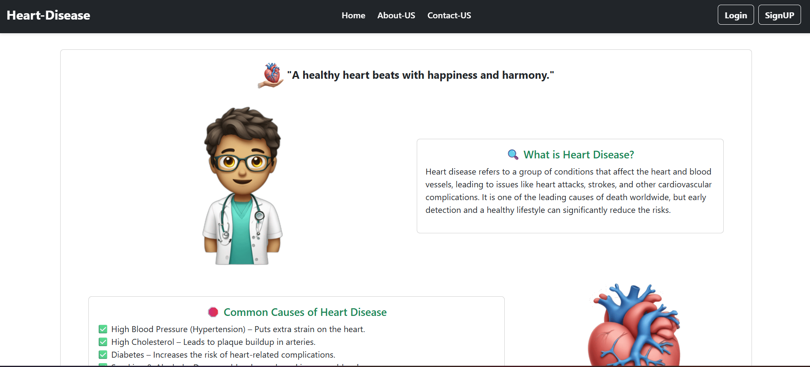
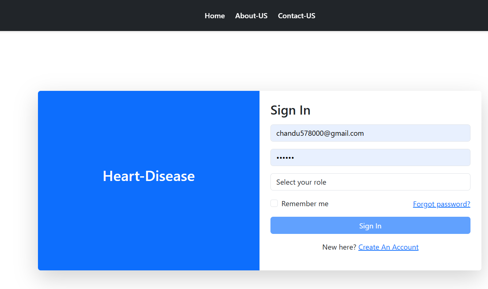
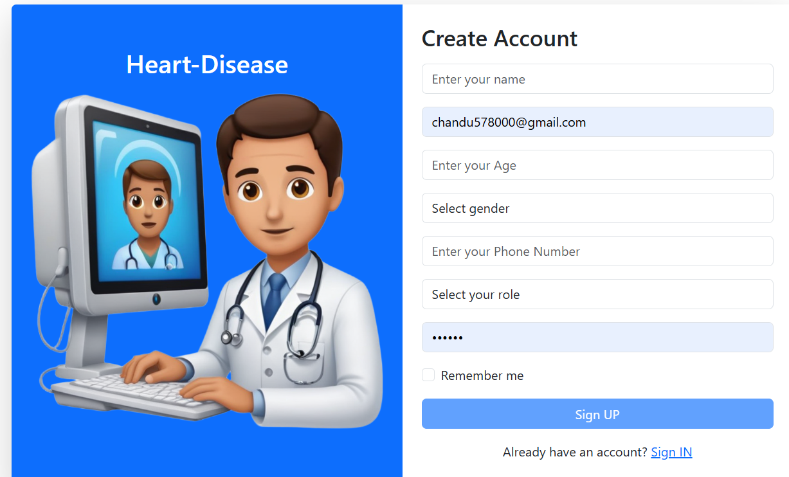
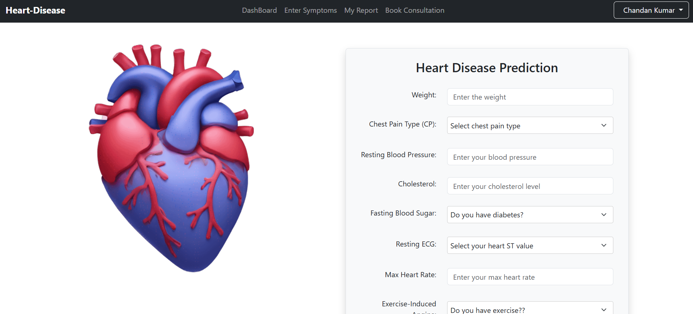
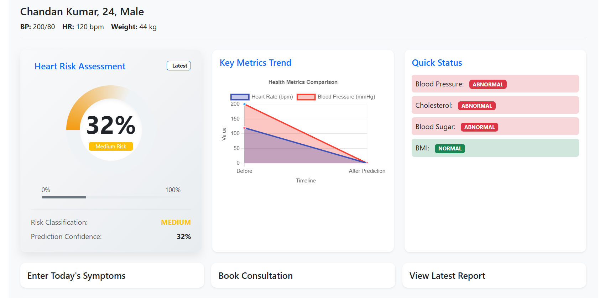

# 📌 Heart-Disease Prediction System

✨ A Heart Disease Prediction System is a data-driven tool that uses machine learning algorithms and patient health data to assess the risk of cardiovascular diseases. By analyzing factors like age, blood pressure, cholesterol levels, and lifestyle habits, the system predicts the likelihood of heart disease, enabling early intervention and personalized healthcare recommendations. It improves diagnostic accuracy and helps doctors make informed decisions for preventive care. Common techniques used include logistic regression, decision trees, and neural networks. 

---

## 🚀 Key Features  
- **📱 User-Friendly Interface** – Simple, intuitive design for easy data input.
- **🩺 Accepts Health Parameters** – Age, BP, cholesterol, ECG, lifestyle habits.
- **🤖 AI-Powered Prediction** – ML models (Logistic Regression, Random Forest, Neural Networks).
- **⚡ Real-Time Risk Assessment** – Instant low/medium/high risk prediction.
- **💡 Personalized Recommendations** – Custom diet, exercise, and medical advice.
- **⌚ Wearable & EHR Integration** – Syncs with smartwatches and health records.
- **🔒 Secure & Compliant** – HIPAA/GDPR-compliant data storage.
- **👥 Multi-User Access** – Separate dashboards for patients, doctors, and admins.
- **📊 Visual Reports & Analytics** – Interactive charts for health trend tracking.
- **☁ Cloud-Based & Scalable** – Accessible on web/mobile, scalable for clinics.
---

## 🛠️ Tech Stack  
| Category       | Technologies Used                          |  
|----------------|-------------------------------------------|  
| **Frontend**   | Angular, Bootstrap, Material-UI, Chart.js              |  
| **Backend**    | Node.js, Express js                          |  
| **Database**   | PostgreSQL                                |  
| **Tools**      | Git, Postman, Vscode                      |  

---
## 📸 Screenshot

### **1. Home Page**


### **2. Login Page**


### 3. Sign UP page


### 4. Patient Symptom Form


----
### 5. Patient Dashboard


---
## 🏁 Quick Start  
1. **Clone the repo**:  
   ```bash  
   git clone https://github.com/chandan578/heart-disease-prediction-system.git
   ```
2. **Install dependencies(try to use anaconda)**
   ```bash
   pip install -r requirements.txt
   ```
3. **Install Nodejs for backend**
4. **Install Angular and its Material UI**
5.  **Run npm install to run load node module**
6.  **Then first run anconda model --> using conda activate venv/ then run --> python predict.py**
7.  **Second run backend file : npm run dev**
8.  **Last run forntend file : ng s -o**
